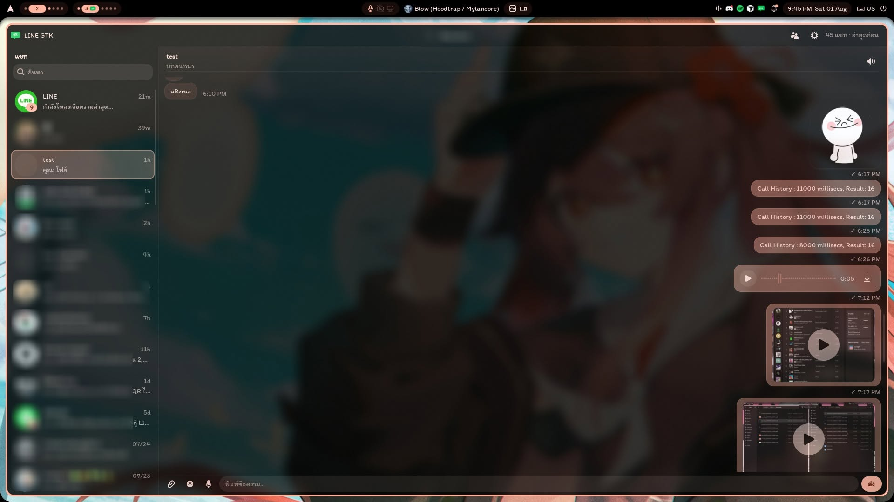

Unofficial native LINE client for Linux. GTK4 / Libadwaita UI with a Deno protocol sidecar ([linejs](https://github.com/evex-dev/linejs)).




---

## Implementation

- [x] QR login (additional device)
- [x] Chats, messages, stickers, friends
- [x] Photos, video, voice messages, files
- [x] In-app viewers (image, video, PDF, text)
- [x] Downloads, tray, Thai / English, themes
- [x] Discord RPC
- [ ] Voice call (WIP)
- [ ] Account switcher

---

## Requirements

| Dependency | Notes |
| --- | --- |
| Rust | stable toolchain |
| GTK4 + Libadwaita | e.g. `pacman -S gtk4 libadwaita` |
| Deno | `~/.deno/bin/deno` or set `DENO` |
| ffmpeg / ffprobe | voice record, video thumbs |
| Optional | `pdftoppm`, `pdftotext` for PDF preview |

Wayland and X11 both work. Tested mainly on Arch-based desktops.

---

## Build and run

```bash
git clone https://github.com/MidnightTale/line-gtk.git
cd line-gtk
cargo build --release
./target/release/line-gtk
```

---

## Warning

This is an unofficial client. Using it may violate LINE Terms of Service. Prefer a secondary account or device session. Expect breakage when LINE changes login or crypto.

---

## Acknowledgments

Protocol and E2EE talk to LINE through [linejs](https://github.com/evex-dev/linejs) by [evex-dev](https://github.com/evex-dev). This app is a GTK frontend around that library; it is not affiliated with LINE Corporation or evex-dev.

---

## License

[GPL-3.0-or-later](LICENSE)
